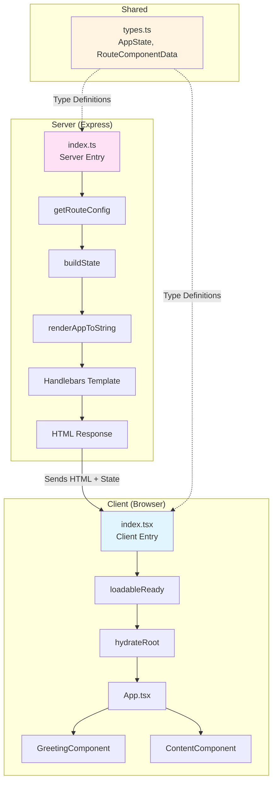
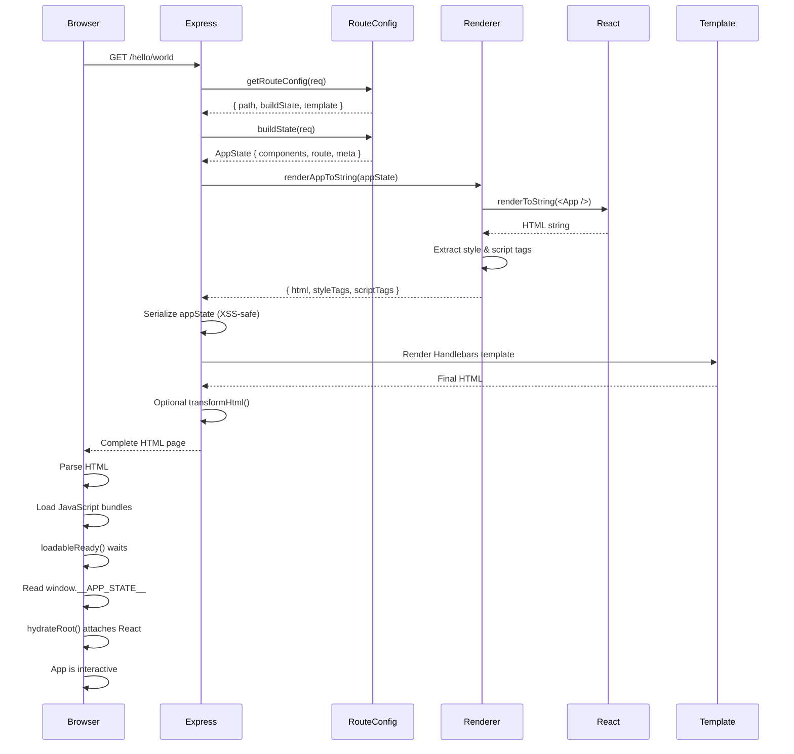
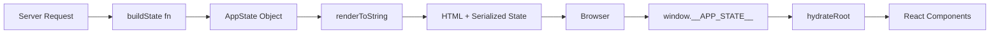
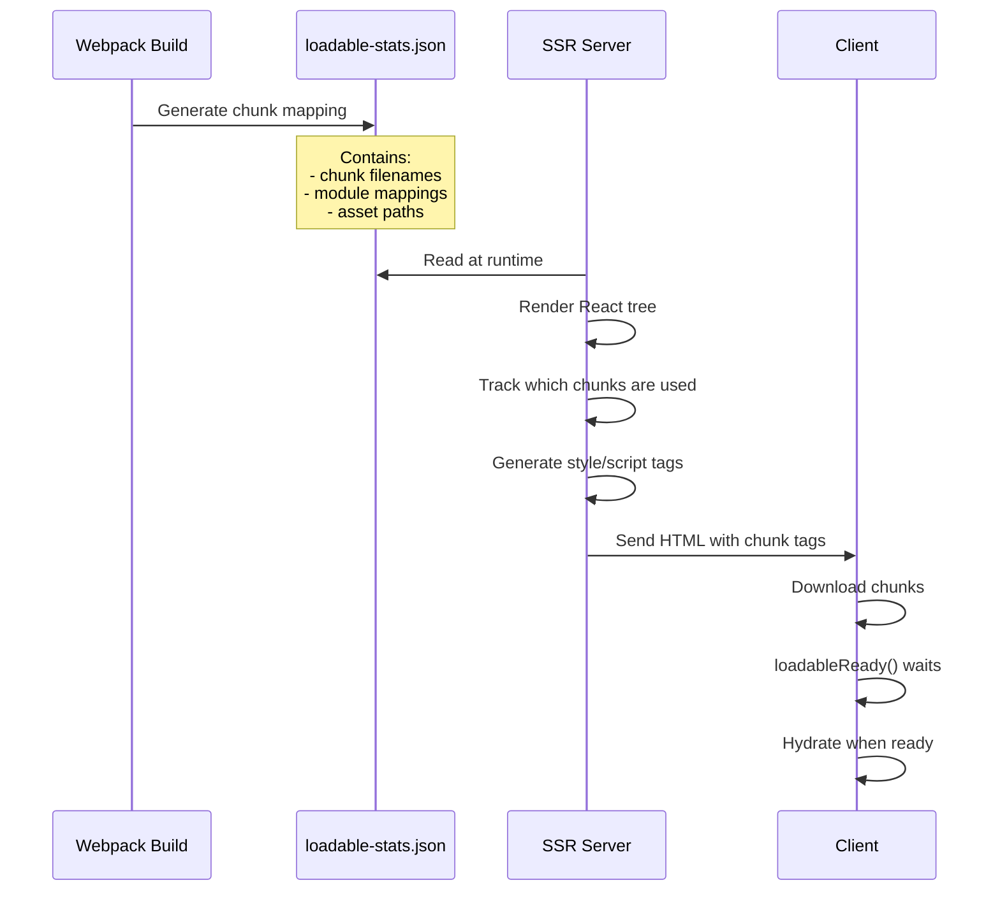

# React-Vite-SSR Architecture Documentation

## Table of Contents
1. [Overview](#overview)
2. [Architecture](#architecture)
3. [SSR Rendering Pipeline](#ssr-rendering-pipeline)
4. [Key Components](#key-components)
5. [Technology Stack](#technology-stack)
6. [Route Configuration](#route-configuration)
7. [State Management](#state-management)
8. [Code Splitting](#code-splitting)
9. [Future Enhancements](#future-enhancements)

---

## Overview

This project implements a **Server-Side Rendering (SSR)** architecture inspired by Skyscanner's Falcon platform. It uses **React 19** with **Express.js** to deliver fully-rendered HTML pages while maintaining client-side interactivity through hydration.

### Key Features
- ✅ Server-side rendering with React 19
- ✅ Route-based configuration system
- ✅ Per-route HTML templates (Handlebars)
- ✅ Code splitting with `@loadable/component`
- ✅ Type-safe state management
- ✅ Nx monorepo structure with pnpm workspaces
- ✅ Hot Module Replacement (HMR) in development

### Project Structure
```
react-vite-ssr/
├── apps/
│   ├── server/          # Express SSR server
│   │   ├── src/
│   │   │   ├── index.ts           # Server entry point
│   │   │   ├── renderer.ts        # SSR rendering logic
│   │   │   ├── routes/
│   │   │   │   └── routeConfig.ts # Route definitions
│   │   │   └── templates/         # Handlebars templates
│   │   └── project.json
│   └── webapp/          # React client application
│       ├── src/
│       │   ├── index.tsx          # Client entry point
│       │   ├── App.tsx            # Root component
│       │   └── components/        # React components
│       └── project.json
├── libs/
│   └── shared/          # Shared TypeScript types
│       └── src/
│           └── types.ts
├── nx.json
├── package.json
└── pnpm-workspace.yaml
```

---

## Architecture

### Component Diagram



### Technology Layers

```
┌─────────────────────────────────────────────────────────┐
│                   Developer Interface                   │
│  Nx Commands • HMR • TypeScript • ESLint • Prettier    │
└─────────────────────────────────────────────────────────┘
                            ↓
┌─────────────────────────────────────────────────────────┐
│                   Application Layer                     │
│    React Components • Route Config • State Builders    │
└─────────────────────────────────────────────────────────┘
                            ↓
┌─────────────────────────────────────────────────────────┐
│                   Rendering Layer                       │
│  SSR (renderToString) • Hydration • Code Splitting     │
└─────────────────────────────────────────────────────────┘
                            ↓
┌─────────────────────────────────────────────────────────┐
│                   Infrastructure Layer                  │
│    Express • Webpack • Babel • Node.js • pnpm          │
└─────────────────────────────────────────────────────────┘
```

---

## SSR Rendering Pipeline

### Complete Request-Response Flow



### Step-by-Step Breakdown

#### 1. Request Arrives
```typescript
// apps/server/src/index.ts:83
app.get('*', (req, res) => {
  // Request handler starts here
});
```

#### 2. Route Matching
```typescript
// apps/server/src/index.ts:86
const routeConfig = getRouteConfig(req);
```

The route matcher ([routeConfig.ts:67-89](apps/server/src/routes/routeConfig.ts#L67-L89)):
- Iterates through configured routes
- Matches static paths (`/`, `/hello`, `/content`)
- Extracts parameters from dynamic routes (`/hello/:name`)
- Returns matched config or default fallback

#### 3. State Building
```typescript
// apps/server/src/index.ts:95
const appState = routeConfig.buildState(req);
```

Each route has a state builder function:

**Home Page** ([routeConfig.ts:11-31](apps/server/src/routes/routeConfig.ts#L11-L31))
```typescript
function buildHomePageState(req: Request): AppState {
  return {
    components: {
      greeting: { name: 'World', onClick: () => {} },
      content: { message: 'Welcome to SSR app!' }
    },
    route: { path: req.path, params: {} },
    meta: {
      title: 'Home Page',
      description: 'React SSR Home Page'
    }
  };
}
```

**Greeting Page** ([routeConfig.ts:33-53](apps/server/src/routes/routeConfig.ts#L33-L53))
```typescript
function buildGreetingPageState(req: Request): AppState {
  const name = req.params.name || 'Guest';
  return {
    components: {
      greeting: { name, onClick: () => {} }
    },
    route: { path: req.path, params: req.params },
    meta: {
      title: `Hello ${name}`,
      description: `Greeting page for ${name}`
    }
  };
}
```

#### 4. React Server Rendering
```typescript
// apps/server/src/index.ts:98
const { html, styleTags, scriptTags } = renderAppToString(appState);
```

The renderer ([renderer.ts:11-43](apps/server/src/renderer.ts#L11-L43)):

```typescript
export function renderAppToString(appState: AppState) {
  // 1. Create ChunkExtractor for code splitting
  const extractor = new ChunkExtractor({
    statsFile: path.resolve(__dirname, '../../../dist/apps/webapp/loadable-stats.json'),
    publicPath: '/static/',
  });

  // 2. Wrap app with chunk collector
  const jsx = extractor.collectChunks(
    <App {...appState.components} />
  );

  // 3. Render to HTML string
  const html = renderToString(jsx);

  // 4. Extract style and script tags
  const styleTags = extractor.getStyleTags();
  const scriptTags = extractor.getScriptTags();

  return { html, styleTags, scriptTags };
}
```

#### 5. State Serialization
```typescript
// apps/server/src/index.ts:101-104
const serializedState = JSON.stringify(appState)
  .replace(/</g, '\\u003c')
  .replace(/>/g, '\\u003e')
  .replace(/\//g, '\\u002f');
```

This creates an XSS-safe JSON string that can be embedded in HTML:
```html
<script>
  window.__APP_STATE__ = {"components":{...}};
</script>
```

#### 6. Template Rendering
```typescript
// apps/server/src/index.ts:106-121
const templateContext = {
  meta: appState.meta || {},
  appHtml: html,
  appState: serializedState,
  styleTags,
  scriptTags,
};

if (routeConfig.template) {
  finalHtml = renderTemplate(routeConfig.template, templateContext);
} else {
  finalHtml = renderDefaultTemplate(templateContext);
}
```

Handlebars template example ([home-page.html](apps/server/src/templates/home-page.html)):
```html
<!DOCTYPE html>
<html lang="en">
<head>
  <meta charset="UTF-8">
  <title>{{meta.title}}</title>
  <meta name="description" content="{{meta.description}}">
  {{{styleTags}}}
</head>
<body>
  <div id="root">{{{appHtml}}}</div>
  <script>window.__APP_STATE__ = {{{appState}}};</script>
  {{{scriptTags}}}
</body>
</html>
```

#### 7. Optional HTML Transformation
```typescript
// apps/server/src/index.ts:124-126
if (routeConfig.transformHtml) {
  finalHtml = routeConfig.transformHtml(finalHtml, appState);
}
```

This hook allows per-route HTML modifications after template rendering.

#### 8. Response Sent
```typescript
// apps/server/src/index.ts:128
res.send(finalHtml);
```

#### 9. Client Hydration
```typescript
// apps/webapp/src/index.tsx:7-21
const appState = window.__APP_STATE__;

if (!appState) {
  console.error('No app state found');
} else {
  loadableReady(() => {
    const root = document.getElementById('root');
    if (root) {
      hydrateRoot(
        root,
        <React.StrictMode>
          <App {...appState.components} />
        </React.StrictMode>
      );
    }
  });
}
```

The hydration process:
1. Read `window.__APP_STATE__` (set by server)
2. Wait for `loadableReady()` (ensures code-split chunks are loaded)
3. Call `hydrateRoot()` to attach React event listeners
4. App becomes fully interactive

---

## Key Components

### Server Components

#### 1. Server Entry Point
**File:** [apps/server/src/index.ts](apps/server/src/index.ts)

**Responsibilities:**
- Express server setup
- Webpack dev/hot middleware (development)
- Gzip compression
- Static file serving
- Route handling and orchestration
- Template rendering

**Key Code:**
```typescript
const app = express();

// Development middleware
if (process.env.NODE_ENV === 'development') {
  const compiler = webpack(webpackConfig);
  app.use(webpackDevMiddleware(compiler, { /* ... */ }));
  app.use(webpackHotMiddleware(compiler));
}

// Production static files
app.use(compression());
app.use('/static', express.static(path.join(__dirname, '../../webapp')));

// Catch-all SSR handler
app.get('*', (req, res) => {
  // SSR logic here
});
```

#### 2. SSR Renderer
**File:** [apps/server/src/renderer.ts](apps/server/src/renderer.ts)

**Responsibilities:**
- React `renderToString` execution
- `@loadable/component` integration
- Chunk extraction for code splitting
- Style and script tag generation

**Key Code:**
```typescript
export function renderAppToString(appState: AppState) {
  const extractor = new ChunkExtractor({
    statsFile: path.resolve(__dirname, '../../../dist/apps/webapp/loadable-stats.json'),
    publicPath: '/static/',
  });

  const jsx = extractor.collectChunks(<App {...appState.components} />);
  const html = renderToString(jsx);
  const styleTags = extractor.getStyleTags();
  const scriptTags = extractor.getScriptTags();

  return { html, styleTags, scriptTags };
}
```

#### 3. Route Configuration
**File:** [apps/server/src/routes/routeConfig.ts](apps/server/src/routes/routeConfig.ts)

**Responsibilities:**
- Route definitions and patterns
- State builder functions
- Route matching with parameter extraction
- Template associations

**Interface:**
```typescript
export interface RouteConfig {
  path: string;
  buildState: (req: Request) => AppState;
  template?: string;
  transformHtml?: (html: string, appState: AppState) => string;
}
```

**Available Routes:**
```typescript
export const routeConfigs: RouteConfig[] = [
  { path: '/', buildState: buildHomePageState, template: 'home-page.html' },
  { path: '/hello', buildState: buildGreetingPageState, template: 'greeting-page.html' },
  { path: '/hello/:name', buildState: buildGreetingPageState, template: 'greeting-page.html' },
  { path: '/content', buildState: buildContentPageState, template: 'content-page.html' },
];
```

### Client Components

#### 1. Client Entry Point
**File:** [apps/webapp/src/index.tsx](apps/webapp/src/index.tsx)

**Responsibilities:**
- Client-side hydration
- Reading `window.__APP_STATE__`
- Waiting for loadable chunks
- Attaching React to DOM

**Key Code:**
```typescript
const appState = window.__APP_STATE__;

loadableReady(() => {
  const root = document.getElementById('root');
  if (root) {
    hydrateRoot(
      root,
      <React.StrictMode>
        <App {...appState.components} />
      </React.StrictMode>
    );
  }
});
```

#### 2. Root Component
**File:** [apps/webapp/src/App.tsx](apps/webapp/src/App.tsx)

**Responsibilities:**
- Conditional component rendering
- Lazy loading with `@loadable/component`
- Props passing to child components

**Key Code:**
```typescript
import loadable from '@loadable/component';

const GreetingComponent = loadable(() => import('./components/Greeting/GreetingComponent'));
const ContentComponent = loadable(() => import('./components/Content/ContentComponent'));

export function App({ greeting, content }: AppProps) {
  return (
    <div>
      {greeting && <GreetingComponent {...greeting} />}
      {content && <ContentComponent {...content} />}
    </div>
  );
}
```

#### 3. React Components
**Files:**
- [apps/webapp/src/components/Greeting/GreetingComponent.tsx](apps/webapp/src/components/Greeting/GreetingComponent.tsx)
- [apps/webapp/src/components/Content/ContentComponent.tsx](apps/webapp/src/components/Content/ContentComponent.tsx)

**GreetingComponent:**
```typescript
export default function GreetingComponent({ name, onClick }: GreetingProps) {
  const handleClick = () => {
    console.log(`Button clicked for ${name}`);
    if (onClick) onClick();
  };

  return (
    <div className="greeting">
      <h1>Hello, {name}!</h1>
      <button onClick={handleClick}>Click me</button>
    </div>
  );
}
```

**ContentComponent:**
```typescript
export default function ContentComponent({ message }: ContentProps) {
  return (
    <div className="content">
      <p>{message}</p>
    </div>
  );
}
```

### Shared Types

#### Type Definitions
**File:** [libs/shared/src/types.ts](libs/shared/src/types.ts)

**Key Interfaces:**
```typescript
// Component props
export interface GreetingProps {
  name: string;
  onClick?: () => void;
}

export interface ContentProps {
  message: string;
}

// Route component data
export interface RouteComponentData {
  greeting?: GreetingProps;
  content?: ContentProps;
}

// Main app state
export interface AppState {
  components: RouteComponentData;
  route: {
    path: string;
    params: Record<string, string>;
  };
  meta?: {
    title?: string;
    description?: string;
  };
}

// Global window extension
declare global {
  interface Window {
    __APP_STATE__: AppState;
  }
}
```

---

## Technology Stack

### Runtime Dependencies

| Package | Version | Purpose |
|---------|---------|---------|
| `react` | 19.2.3 | UI library |
| `react-dom` | 19.2.3 | React DOM rendering |
| `express` | 5.2.1 | Web server |
| `@loadable/component` | 5.16.7 | Code splitting |
| `@loadable/server` | 5.16.7 | SSR code splitting |
| `handlebars` | 4.7.8 | HTML templating |
| `compression` | 1.7.5 | Gzip compression |

### Build Tools

| Package | Version | Purpose |
|---------|---------|---------|
| `webpack` | 5.104.1 | Module bundler |
| `@babel/core` | 7.28.5 | JavaScript compiler |
| `typescript` | 5.9.3 | Type checking |
| `@nx/workspace` | 22.3.3 | Monorepo tools |
| `pnpm` | 9.15.9 | Package manager |

### Development Tools

| Package | Version | Purpose |
|---------|---------|---------|
| `nodemon` | 3.1.11 | Auto-restart server |
| `webpack-dev-middleware` | 7.4.5 | Dev server |
| `webpack-hot-middleware` | 2.26.1 | Hot module replacement |
| `@babel/preset-react` | 7.26.5 | React JSX transform |
| `@loadable/webpack-plugin` | 5.16.7 | Generate loadable stats |

---

## Route Configuration

### Route Definition Pattern

Each route is defined using the `RouteConfig` interface:

```typescript
export interface RouteConfig {
  path: string;                                      // URL pattern
  buildState: (req: Request) => AppState;           // Data builder
  template?: string;                                 // Optional HTML template
  transformHtml?: (html: string, state: AppState) => string;  // Optional transform
}
```

### Current Routes

#### 1. Home Page - `/`
**Template:** [home-page.html](apps/server/src/templates/home-page.html) (purple gradient)
**Components:** Greeting + Content
**State:**
```typescript
{
  components: {
    greeting: { name: 'World', onClick: () => {} },
    content: { message: 'Welcome to SSR app!' }
  },
  route: { path: '/', params: {} },
  meta: { title: 'Home Page', description: 'React SSR Home Page' }
}
```

#### 2. Default Greeting - `/hello`
**Template:** [greeting-page.html](apps/server/src/templates/greeting-page.html) (pink gradient)
**Components:** Greeting
**State:**
```typescript
{
  components: {
    greeting: { name: 'Guest', onClick: () => {} }
  },
  route: { path: '/hello', params: {} },
  meta: { title: 'Hello Guest', description: 'Greeting page for Guest' }
}
```

#### 3. Personalized Greeting - `/hello/:name`
**Template:** [greeting-page.html](apps/server/src/templates/greeting-page.html) (pink gradient)
**Components:** Greeting
**Dynamic Parameter:** Extracts `name` from URL
**Example:** `/hello/alice` → `name = "alice"`
**State:**
```typescript
{
  components: {
    greeting: { name: 'alice', onClick: () => {} }
  },
  route: { path: '/hello/alice', params: { name: 'alice' } },
  meta: { title: 'Hello alice', description: 'Greeting page for alice' }
}
```

#### 4. Content Demo - `/content`
**Template:** [content-page.html](apps/server/src/templates/content-page.html) (blue gradient)
**Components:** Content
**State:**
```typescript
{
  components: {
    content: { message: 'Standalone Content component demo' }
  },
  route: { path: '/content', params: {} },
  meta: { title: 'Content Demo | React SSR Demo', description: 'Demonstration of Content component with SSR' }
}
```

### Adding New Routes

To add a new route:

1. **Define state builder** in [routeConfig.ts](apps/server/src/routes/routeConfig.ts):
```typescript
function buildMyPageState(req: Request): AppState {
  return {
    components: {
      // Add your component props
    },
    route: { path: req.path, params: req.params },
    meta: { title: 'My Page', description: 'My custom page' }
  };
}
```

2. **Create template** (optional) in `apps/server/src/templates/my-page.html`:
```html
<!DOCTYPE html>
<html lang="en">
<head>
  <title>{{meta.title}}</title>
  {{{styleTags}}}
</head>
<body>
  <div id="root">{{{appHtml}}}</div>
  <script>window.__APP_STATE__ = {{{appState}}};</script>
  {{{scriptTags}}}
</body>
</html>
```

3. **Register route** in `routeConfigs` array:
```typescript
export const routeConfigs: RouteConfig[] = [
  // ... existing routes
  { path: '/my-page', buildState: buildMyPageState, template: 'my-page.html' },
];
```

---

## State Management

### State Flow Architecture



### State Structure

The entire application state is encapsulated in the `AppState` interface:

```typescript
interface AppState {
  components: RouteComponentData;  // Component props
  route: {
    path: string;                   // Current path
    params: Record<string, string>; // URL parameters
  };
  meta?: {
    title?: string;                 // Page title
    description?: string;           // Meta description
  };
}
```

### Component Data Types

```typescript
interface RouteComponentData {
  greeting?: GreetingProps;  // Optional greeting component
  content?: ContentProps;    // Optional content component
}

interface GreetingProps {
  name: string;
  onClick?: () => void;
}

interface ContentProps {
  message: string;
}
```

### State Lifecycle

#### 1. Server-Side State Creation
```typescript
// apps/server/src/routes/routeConfig.ts
function buildHomePageState(req: Request): AppState {
  return {
    components: {
      greeting: { name: 'World', onClick: () => {} },
      content: { message: 'Welcome!' }
    },
    route: { path: req.path, params: {} },
    meta: { title: 'Home', description: 'Home page' }
  };
}
```

#### 2. State Serialization
```typescript
// apps/server/src/index.ts:101-104
const serializedState = JSON.stringify(appState)
  .replace(/</g, '\\u003c')   // Prevent </script> injection
  .replace(/>/g, '\\u003e')
  .replace(/\//g, '\\u002f');
```

#### 3. State Embedding
```html
<!-- In HTML template -->
<script>
  window.__APP_STATE__ = {"components":{"greeting":{"name":"World"}}};
</script>
```

#### 4. Client-Side State Consumption
```typescript
// apps/webapp/src/index.tsx
const appState = window.__APP_STATE__;

hydrateRoot(
  root,
  <App {...appState.components} />
);
```

### Type Safety

TypeScript ensures type safety across the entire pipeline:

1. **Server builds state** → TypeScript validates `AppState` structure
2. **State serialized to JSON** → Type information preserved via shared types
3. **Client reads state** → TypeScript validates props match component expectations
4. **Components render** → Props are fully typed

Example:
```typescript
// This would fail TypeScript compilation:
const badState: AppState = {
  components: {
    greeting: { name: 123 }  // ❌ Type 'number' is not assignable to type 'string'
  },
  route: { path: '/', params: {} }
};
```

---

## Code Splitting

### Implementation with @loadable/component

Code splitting is implemented using `@loadable/component`, which allows dynamic imports while maintaining SSR support.

### Client-Side Code Splitting

**File:** [apps/webapp/src/App.tsx](apps/webapp/src/App.tsx)

```typescript
import loadable from '@loadable/component';

// Lazy-loaded components
const GreetingComponent = loadable(() =>
  import('./components/Greeting/GreetingComponent')
);
const ContentComponent = loadable(() =>
  import('./components/Content/ContentComponent')
);

export function App({ greeting, content }: AppProps) {
  return (
    <div>
      {greeting && <GreetingComponent {...greeting} />}
      {content && <ContentComponent {...content} />}
    </div>
  );
}
```

### Server-Side Chunk Extraction

**File:** [apps/server/src/renderer.ts](apps/server/src/renderer.ts)

```typescript
import { ChunkExtractor } from '@loadable/server';

export function renderAppToString(appState: AppState) {
  // 1. Create extractor with loadable stats
  const extractor = new ChunkExtractor({
    statsFile: path.resolve(__dirname, '../../../dist/apps/webapp/loadable-stats.json'),
    publicPath: '/static/',
  });

  // 2. Wrap app to collect used chunks
  const jsx = extractor.collectChunks(
    <App {...appState.components} />
  );

  // 3. Render to HTML
  const html = renderToString(jsx);

  // 4. Extract tags for used chunks
  const styleTags = extractor.getStyleTags();  // <link> tags
  const scriptTags = extractor.getScriptTags(); // <script> tags

  return { html, styleTags, scriptTags };
}
```

### How It Works



### Generated Output

When a page uses `GreetingComponent`, the server generates:

**Style Tags:**
```html
<link rel="stylesheet" href="/static/GreetingComponent.chunk.css">
```

**Script Tags:**
```html
<script src="/static/GreetingComponent.chunk.js"></script>
```

### Client Hydration

```typescript
// apps/webapp/src/index.tsx
loadableReady(() => {
  // This waits for all code-split chunks to load
  hydrateRoot(root, <App {...appState.components} />);
});
```

### Benefits

1. **Reduced Initial Bundle Size** - Only code for required components is loaded
2. **Better Performance** - Parallel chunk downloads
3. **SSR Support** - Server knows which chunks to include
4. **Type Safety** - Full TypeScript support
5. **Automatic Splitting** - Webpack handles chunk generation

### Webpack Configuration

**File:** [config/webpack.webapp.dev.ts](config/webpack.webapp.dev.ts) / [config/webpack.webapp.prod.ts](config/webpack.webapp.prod.ts)

```typescript
const LoadablePlugin = require('@loadable/webpack-plugin');

module.exports = {
  plugins: [
    new LoadablePlugin({
      filename: 'loadable-stats.json',
      writeToDisk: true,
    }),
  ],
  optimization: {
    splitChunks: {
      chunks: 'all',
      // Automatically split node_modules into separate chunks
    },
  },
};
```

---

## Future Enhancements

### 1. Vite Migration
**Status:** 🔴 Not Implemented

**Current State:**
- Project uses **Webpack 5** for bundling
- Webpack dev/hot middleware for development

**Goal:**
- Migrate to **Vite** for faster builds and HMR
- Leverage Vite's native ESM support

**Benefits:**
- ⚡ Instant cold start
- ⚡ Lightning-fast HMR
- 🎯 Optimized production builds
- 📦 Smaller bundle sizes

**Migration Steps:**
1. Replace Webpack config with `vite.config.ts`
2. Update dev server to use `vite-node` middleware
3. Replace `@loadable/webpack-plugin` with Vite equivalent
4. Update build scripts in `project.json`

### 2. React 19 Streaming SSR
**Status:** 🔴 Not Implemented

**Current State:**
- Uses `renderToString` (blocks until complete)
- Entire HTML rendered before sending

**Goal:**
- Implement `renderToPipeableStream` or `renderToReadableStream`
- Stream HTML chunks as they become ready

**Benefits:**
- 🚀 Faster Time to First Byte (TTFB)
- 📊 Progressive rendering
- 🔄 Better error handling with Suspense boundaries

**Example Implementation:**
```typescript
import { renderToPipeableStream } from 'react-dom/server';

function streamSSR(req: Request, res: Response, appState: AppState) {
  const { pipe } = renderToPipeableStream(
    <App {...appState.components} />,
    {
      bootstrapScripts: ['/static/client.js'],
      onShellReady() {
        res.setHeader('Content-Type', 'text/html');
        pipe(res);
      },
      onError(error) {
        console.error('SSR error:', error);
      },
    }
  );
}
```

### 3. Enhanced Code Splitting
**Status:** 🟡 Partially Implemented

**Current State:**
- Component-level splitting with `@loadable/component`
- Manual import statements

**Potential Improvements:**
- Route-based code splitting
- Preload critical chunks
- Prefetch on hover/viewport
- Dynamic imports based on user interactions

**Example:**
```typescript
// Route-based splitting
const routes = [
  {
    path: '/',
    component: loadable(() => import('./pages/Home')),
  },
  {
    path: '/hello/:name',
    component: loadable(() => import('./pages/Greeting')),
  },
];

// Prefetch on hover
<Link
  to="/hello/world"
  onMouseEnter={() => preloadComponent(() => import('./pages/Greeting'))}
>
  Go to Greeting
</Link>
```

### 4. Advanced Rendering Features

#### Incremental Static Regeneration (ISR)
- Cache rendered pages
- Revalidate after time threshold
- Serve stale while revalidating

#### Partial Hydration
- Only hydrate interactive components
- Use `<script type="module">` for islands
- Reduce JavaScript overhead

#### Edge Rendering
- Deploy to edge functions (Cloudflare Workers, Vercel Edge)
- Reduce latency with geo-distributed rendering

### 5. Performance Monitoring

**Potential Additions:**
- Server-side timing metrics
- Client-side performance marks
- Real User Monitoring (RUM)
- Lighthouse CI integration

**Example:**
```typescript
// Server timing
res.setHeader('Server-Timing', [
  `ssr;dur=${ssrTime}`,
  `template;dur=${templateTime}`,
  `total;dur=${totalTime}`,
].join(', '));

// Client performance
performance.mark('hydration-start');
hydrateRoot(root, <App />);
performance.mark('hydration-end');
performance.measure('hydration', 'hydration-start', 'hydration-end');
```

### 6. Developer Experience

**Planned Improvements:**
- Error boundaries with better stack traces
- Development-only debugging tools
- Component inspector overlay
- SSR vs CSR diff checker

---

## Conclusion

This architecture provides a solid foundation for server-side rendered React applications, inspired by production-grade patterns from Skyscanner's Falcon platform. The current implementation is production-ready and demonstrates:

✅ Clean separation of concerns (server/client/shared)
✅ Type-safe state management across SSR boundary
✅ Flexible route-based configuration system
✅ Per-route template customization
✅ Efficient code splitting with SSR support
✅ Modern monorepo tooling (Nx + pnpm)

### Next Steps

1. **Production Deployment** - Set up CI/CD pipeline with Nx affected commands
2. **Performance Optimization** - Implement streaming SSR and advanced caching
3. **Vite Migration** - Modernize build tooling for faster development
4. **Monitoring** - Add observability and performance tracking
5. **Testing** - Expand unit and E2E test coverage

For questions or contributions, refer to the main [CHANGELOG.md](CHANGELOG.md) and [ARCHITECTURE.md](ARCHITECTURE.md) documents.
